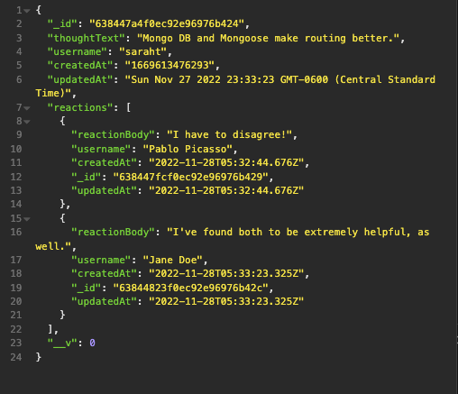
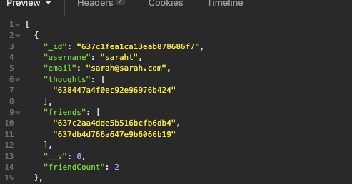

# NoSQL Social Network API

[](https://opensource.org/licenses/MIT)

**[Walkthrough Video](https://drive.google.com/file/d/13_zpK8pwDv1sUA__JHSpY0fLWahxLk0Y/view?usp=sharing)**

[Video 2/2 (this final delete functionality was cut off from original video)](https://drive.google.com/file/d/1MsMrAJzaQMkMMQrBHezTS2n3EZ8Nf62W/view?usp=sharing)

  **Completion Date:**  11/22/22 <br>
 
  **Technologies used:**  JavaScript, Express.js, Node, MongoDB, Mongoose<br>

  **Project goal:** Build an API for a social network crud app where users can share thoughts, react to friends' thoughts and create a friend list. <br>


  ## Table of Contents
  1. [Project Description](#Description)
  2. [Usage](#Usage)
  3. [Challenges Encounted](#Challenges)
  4. [Tests](#Tests)
  5. [License](#License)
  <br>
  
  ## Description
Using MongoDB and Mongoose, I've created the back-end of a social network web app that allows for user creating, input, and interaction between users via "thoughts" and "reactions". Thoughts and reactions are date-stamped and can be updated and deleted. Additionally, users have the ability to add and delete other users and store them as Friends. 

## User Story

```md
AS A social media startup
I WANT an API for my social network that uses a NoSQL database
SO THAT my website can handle large amounts of unstructured data
```

## Acceptance Criteria

```md
GIVEN a social network API
WHEN I enter the command to invoke the application
THEN my server is started and the Mongoose models are synced to the MongoDB database
WHEN I open API GET routes in Insomnia for users and thoughts
THEN the data for each of these routes is displayed in a formatted JSON
WHEN I test API POST, PUT, and DELETE routes in Insomnia
THEN I am able to successfully create, update, and delete users and thoughts in my database
WHEN I test API POST and DELETE routes in Insomnia
THEN I am able to successfully create and delete reactions to thoughts and add and remove friends to a user’s friend list
```


## Usage and Installation

Mongoose and MongoDB will need to be installed prior to running the application.

```npm install mongoose express```

Users can access the server by running 
```node server.js``` in the terminal.


## Insomnia Screenshots


_<div align="center">Thoughts object layout w/ reaction nested array</div>_
</br></br>
 
_<div align="center">User object layout w/ thoughts and friends info</div>_


  ## Challenges

Despite having a less-than-positive experience with routes in a recent Handlebars project, I found the MVC model within the Mongo framework to be much clearer to navigate. There is still some quirkiness with Mongo, especially around the usage of virtuals and model creation, but I found it to be a much more straightforward method of implementation. 

Date formatting was a bit of a challenge, but I found converting the type to String allowed for some conversion. In hindsight, installing the date-fns npm package for conversion might have been the better route.

  ## Tests

  No tests were written for this program.

  ## License

  Click the badge to learn more about the license used for this project.
  <br>[](https://opensource.org/licenses/MIT)

  ## Questions?

  Find me on GitHub at: https://github.com/sarahthoorens

  You can also send any questions about this project to: s.thoorens@gmail.com

